::: {#inicio .hero}
:::

:::::: {#sobre-proyecto}
::::: {.sobre-wrapper}
::: {.sobre-texto}

# Sobre el proyecto

Desde 2019, el proyecto Snapshot se dedica al monitoreo global,
estandarizado y de largo plazo de mamíferos terrestres de mediano y gran
porte, mediante iniciativas colaborativas que integran grupos de
investigación, instituciones, científicos/as y personas entusiastas de
la naturaleza y la ciencia ciudadana.

Esta red internacional no solo impulsa el avance en la generación y
disponibilidad de datos abiertos a gran escala, sino que también
fortalece y amplía la cooperación entre equipos de investigación a nivel
nacional e internacional.

Actualmente, el proyecto está presente en diversos países, incluyendo
Estados Unidos, Japón, Europa y, desde 2025, también en América del Sur,
con su expansión hacia Brasil y ahora hacia Paraguay.

Con **Snapshot Paraguay** buscamos establecer un programa de monitoreo
de largo plazo que permita evaluar la biodiversidad de mamíferos
terrestres y comprender cómo cambian los ecosistemas en un contexto de
transformaciones ambientales y climáticas aceleradas.

A través de esta nueva red de colaboración, buscamos potenciar
conexiones científicas, generar oportunidades para nuevas alianzas,
involucrar más instituciones del país y fomentar investigaciones
innovadoras que contribuyan a la conservación de la biodiversidad
paraguaya.
:::


::: sobre-imagen
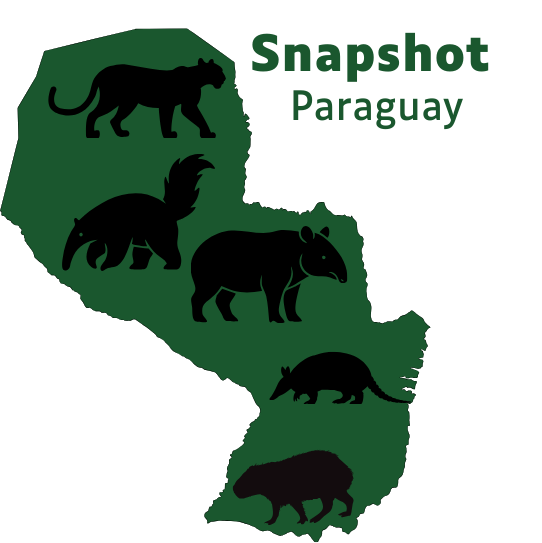
:::
:::::

::: {.protocolo-img}
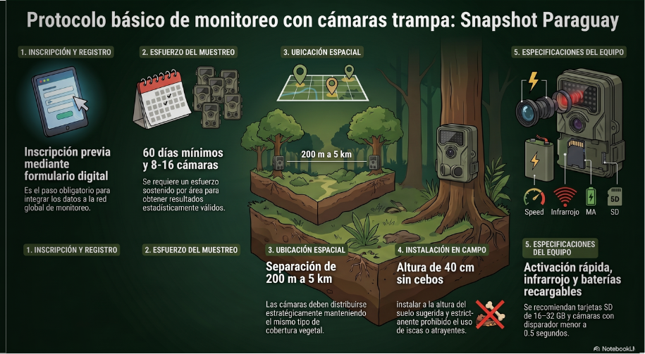
:::

::::::

::: {#protocolo}
# Protocolo e inscripción

### Inscripción
Sumarte a Snapshot Paraguay es muy simple 
Solo tenés que completar el formulario de inscripción en el siguiente enlace:

**Formulario de inscripción:** 
`https://forms.gle/TU-LINK`

Con esta información podremos conocerte mejor y acompañarte en el proceso de instalación y monitoreo.
Una vez que recibamos tu formulario, el equipo se pondrá en contacto para los próximos pasos.
Si te surge cualquier duda, podés escribirnos con confianza a: snapshotparaguay@gmail.com

:::::::::::::::::: {#colaboradores}
## Colaboradores

::::::::::::::::: colab-wrapper
:::: colab-item
::: colab-logo
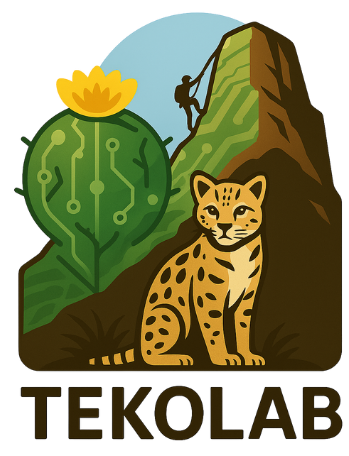
:::

### TekoLab – Cerro Kavaju

TekoLab es el laboratorio vivo de innovación socioambiental que impulsa
las acciones de conservación, restauración ecológica, senderismo y
escalada responsable en el Cerro Kavaju (Departamento de Cordillera).

Desde TekoLab se coordina el área piloto de Snapshot Paraguay,
incluyendo:

-   Instalación y mantenimiento de cámaras trampa.\
-   Monitoreo de mamíferos de mediano y gran porte.\
-   Educación ambiental y trabajo con comunidades locales.\
-   Apoyo a investigaciones sobre biodiversidad y uso público del cerro.
::::

:::: colab-item
::: colab-logo
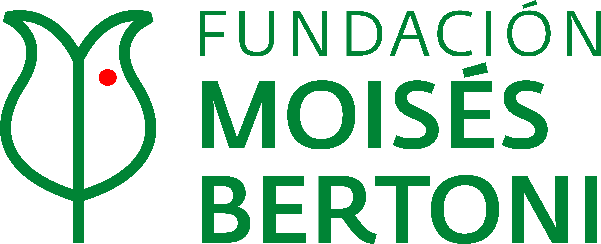
:::

### Fundación Moisés Bertoni

La Fundación Moisés Bertoni (FMB) es una asociación privada sin fines de
lucro de Paraguay que trabaja en la conservación de la naturaleza y en
la promoción del desarrollo sostenible, entendiendo este como la
creación de valor en la triple línea de resultados: ambiental, social y
económica. Su objetivo es contribuir al mejoramiento de la calidad de
vida, a través de la preservación de la biodiversidad, el manejo
responsable de los recursos naturales y el impulso de actividades
productivas sostenibles para beneficio de las generaciones presentes y
futuras.
::::

:::: colab-item
::: colab-logo
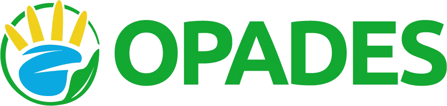
:::

### OPADES – Organización Paraguaya de Conservación y Desarrollo Sostenible

Organización sin fines de lucro que trabaja por la conservación de la
biodiversidad y la promoción del desarrollo sostenible, integrando la
educación ambiental, la ciencia ciudadana y el fortalecimiento de las
comunidades locales como ejes de acción. Desde OPADES se impulsan
iniciativas de investigación participativa y monitoreo de la fauna
silvestre, promoviendo el uso de herramientas como las cámaras trampa
para generar información científica que contribuya a la toma de
decisiones en conservación y al conocimiento de la biodiversidad local.
Busca fortalecer el vínculo entre la ciencia, la conservación y la
sociedad, fomentando una participación activa de las personas en la
protección del patrimonio natural del Paraguay.

OPADES apoya y coordina acciones como: 

-   Instalación y mantenimiento de cámaras trampa.\
-   Monitoreo de fauna.\ 
-   Formación de voluntarios y actores locales en ciencia ciudadana.\
-   Educación ambiental y sensibilización sobre la importancia de la biodiversidad.\
-   Generación de datos para la conservación y la gestión de áreas naturales protegidas.
::::

:::: colab-item
::: colab-logo
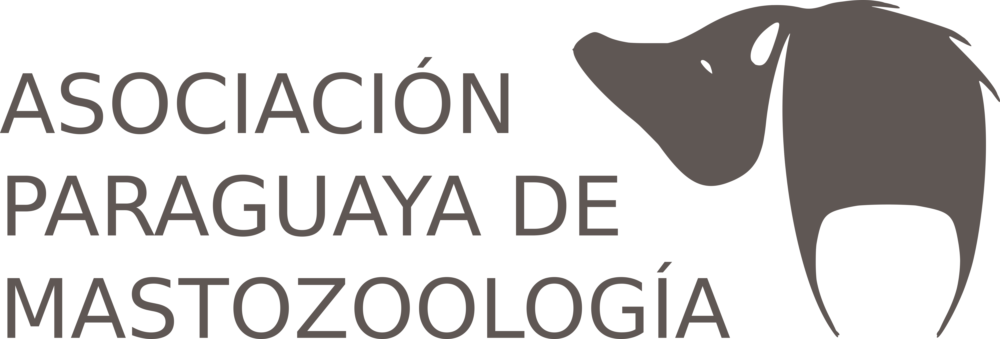
:::

### APM - Asociación Paraguaya de Mastozoología

Es una organización de la sociedad civil de Paraguay, sin fines de lucro, fundada a través de una asamblea el 02 de agosto de 2013. La asociación congrega a los profesionales y estudiantes mastozoólogos que dedican su trabajo al estudio, la investigación científica y la conservación de los mamíferos del Paraguay.

Entre sus objetivos se encuentra:

-   Fomentar y promover la investigación científica en el país, contribuyendo a la difusión, comprensión e impacto de los resultados alcanzados.\
-   Fomentar y promover el trabajo conjunto e interdisciplinario de distintas instituciones y personas interesadas en el estudio y conservación de mamíferos en general a nivel nacional e internacional.\
-   Difusión del conocimiento de los mamíferos y sus roles ecosistémicos a distintos sectores de la sociedad.\

::::

:::: colab-item
::: colab-logo
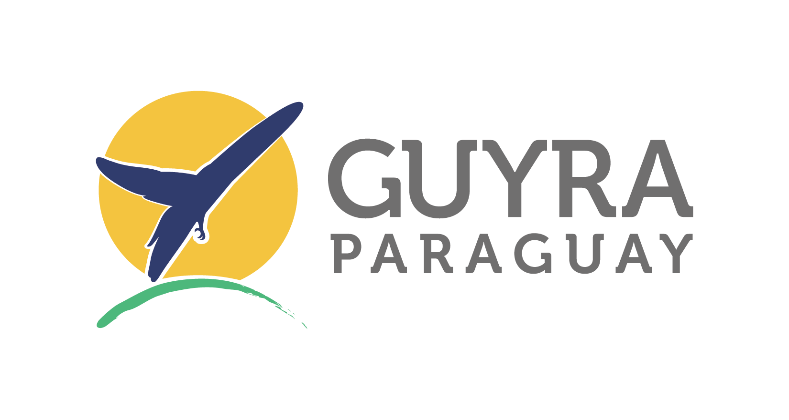
:::

### Guyra Paraguay

Es una organización de la sociedad civil sin fines de lucro que trabaja en la defensa y protección de la diversidad biológica de Paraguay y la acción organizada de la población, con el fin de asegurar el espacio vital necesario para que las futuras generaciones puedan conocer muestras representativas de la riqueza natural del Paraguay. 

Cuenta con un enfoque estratégico en torno a las especies, los sitios, la sociedad, los sistemas y la ecología de paisaje, conectando a las personas con los hábitat y la biodiversidad, e integra soluciones basadas en naturaleza que promueven la restauración, el desarrollo de la investigación y un cambio en nuestro comportamiento a fin de garantizar un futuro más sostenible.

::::

:::::::::::::::::
::::::::::::::::::

::: {#areas}
# Áreas de muestreo

Estas son las áreas de muestreo actualmente activas en **Snapshot
Paraguay**.\
En esta primera versión se incluye solamente el área piloto de **Cerro
Kavaju**.\
En futuras versiones se agregarán nuevas áreas, ecorregiones, número de
cámaras y otros indicadores.

```{r, echo=FALSE, warning=FALSE, message=FALSE}
library(leaflet)
library(tibble)

# Tabla de puntos de muestreo (por ahora 1 sitio)
puntos <- tibble(
  nombre     = "Cerro Kavaju",
  lat        = -25.304816,
  lng        = -57.129486,
  ecorregion = "Paraguay Central",
  ecosistema = "Bosque",
  camaras    = 6
)

# Icono tipo cámara (Font Awesome)
icon_cam <- awesomeIcons(
  icon        = "camera",
  library     = "fa",
  iconColor   = "white",
  markerColor = "darkgreen"
)

leaflet(puntos) |>
  addProviderTiles(leaflet::providers$OpenStreetMap) |>
  setView(lng = -57.129486, lat = -25.304816, zoom = 13) |>
  addAwesomeMarkers(
    lng = ~lng,
    lat = ~lat,
    icon = icon_cam,
    popup = ~paste0(
      "<strong>", nombre, "</strong><br/>",
      "Ecorregión: ", ecorregion, "<br/>",
      "Ecosistema: ", ecosistema, "<br/>",
      "Cantidad de cámaras: ", camaras
    ),
    label = ~paste0("Cámaras: ", camaras),
    labelOptions = labelOptions(
      direction = "top",
      textsize  = "12px",
      offset    = c(0, -5)
    )
  )
```
:::

:::: {#galeria}
# Galería

::: masonry
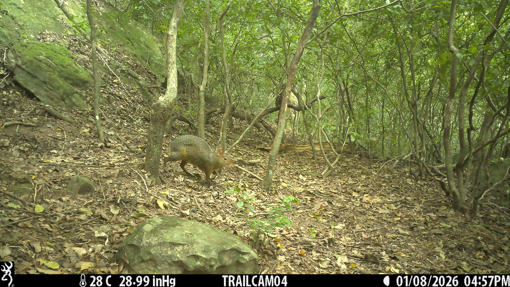
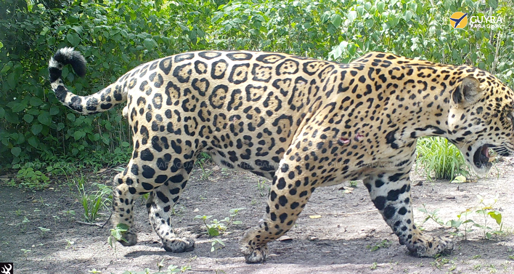
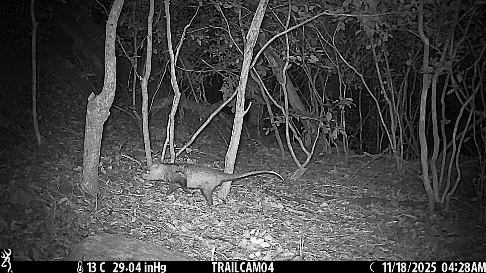
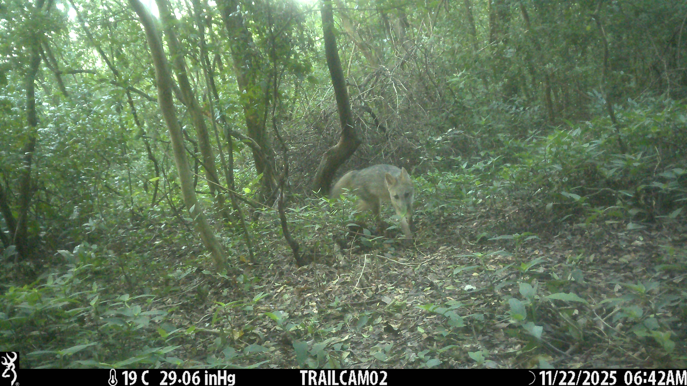


:::
::::

::: {#contacto}
# Contacto

📧 Email: **snapshotparaguay@gmail.com**
:::


::: {#img-lightbox .img-lightbox}

:::

```{=html}
<script>
  // Efecto navbar con scroll
  document.addEventListener("scroll", function() {
    const navbar = document.querySelector(".navbar");
    const hero   = document.querySelector(".hero");
    if (!navbar || !hero) return;

    const heroHeight = hero.offsetHeight;

    if (window.scrollY > heroHeight - 80) {
      navbar.classList.add("scrolled");
    } else {
      navbar.classList.remove("scrolled");
    }
  });

  // Lightbox sencillo para la galería
  document.addEventListener("DOMContentLoaded", function() {
    const lightbox = document.getElementById("img-lightbox");
    const lightboxImg = document.getElementById("img-lightbox-img");

    // Todas las imágenes de la galería Masonry
    document.querySelectorAll(".masonry img").forEach(function(img) {
      img.style.cursor = "zoom-in";
      img.addEventListener("click", function() {
        lightboxImg.src = img.src;
        lightbox.classList.add("open");
      });
    });

    // Cerrar al hacer click en el fondo
    lightbox.addEventListener("click", function() {
      lightbox.classList.remove("open");
    });

    // Cerrar con tecla Esc
    document.addEventListener("keydown", function(e) {
      if (e.key === "Escape") {
        lightbox.classList.remove("open");
      }
    });
  });
</script>
```
